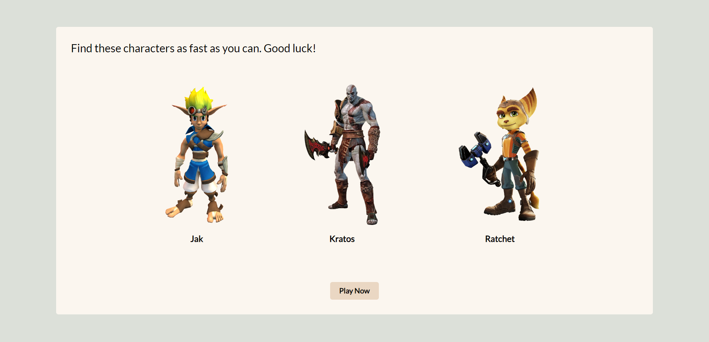
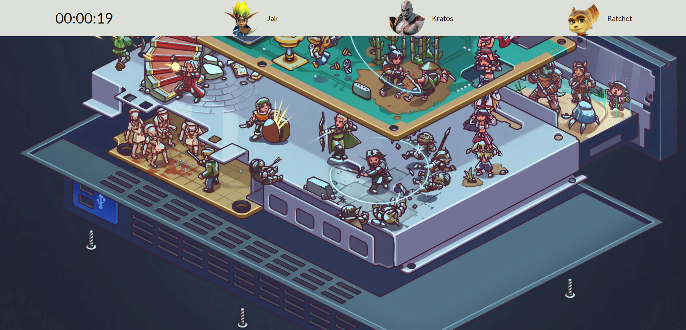

# Where's Waldo Game

My take on "Where's Waldo" game where player has to find characters within an image.

## Technologies Used

- React
- JavaScript
- HTML
- CSS
- Firebase

## Features

- Interactive image with characters hidden within
- Timer to track the player's time
- Leaderboard to display top scores
- Responsive design for different screen sizes

## Demo

You can play the game online by visiting [Where's Waldo Game Game Demo](https://ikojun00.github.io/where-is-waldo)

## Screenshots

